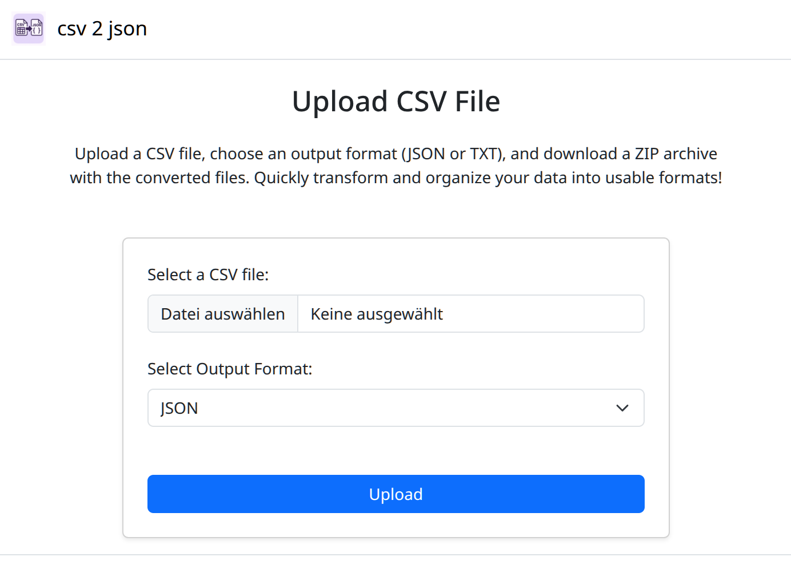

# CSV to JSON Converter

This is a simple web application that converts CSV files to a series of JSON or TXT files. Each row in the uploaded CSV is converted into a separate file, and the resulting files are then compressed into a single ZIP archive for download.




## Features

- Upload a CSV file.
- Choose to convert each row to either a JSON object or a TXT file.
- Download a ZIP archive containing the converted files.

## How to Use

1.  Navigate to the application's homepage.
2.  Click the "Choose File" button to select a CSV file from your local machine.
3.  Select the desired output format (JSON or TXT).
4.  Click the "Upload" button to begin the conversion process.
5.  Your browser will automatically download a ZIP archive containing the converted files.

## Running the Application

You can run this application using either the .NET SDK or Docker.

### Prerequisites

- [.NET 9.0 SDK](https://dotnet.microsoft.com/download/dotnet/9.0)
- [Docker](https://www.docker.com/products/docker-desktop) (optional)

### Running with .NET

1.  Clone this repository to your local machine.
2.  Open a terminal and navigate to the project's root directory.
3.  Run the following command to start the application:

    ```bash
    dotnet run
    ```

4.  Open your web browser and navigate to `http://localhost:5000` to use the application.

### Running with Docker

1.  Clone this repository to your local machine.
2.  Open a terminal and navigate to the project's root directory.
3.  Run the following command to build and run the application in a Docker container:

    ```bash
    docker-compose up --build
    ```

4.  Open your web browser and navigate to `http://localhost:8080` to use the application.
